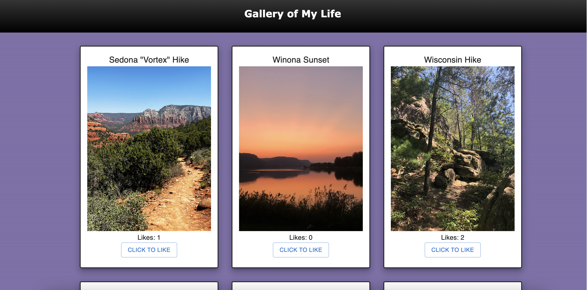

# PROJECT NAME

Weekend React Gallery 

## Description

This web application was created to display photos and allow users to "like" them if they desire.  

## Preview

 

## Duration

Multiple days of work over a 2 week period.

### Prerequisites

- Node.js
- Nodemon
- React

## Installation

1. Open up your editor of choice and run `npm install nodemon --global`
2. Run `npm install`
2. Now open the built-in terminal and enter `npm run server
3. In a different tab of the terminal, enter `npm run client`
4. A browser window should open automatically. 

## Usage

1. Simply view the photos.
2. Click on the photo to display a brief description. Click the photo again to hide the description and view the photo.
2. If you fancy a certain photo, click the "click to like" button and watch the like count go up.
3. That's it!

## Built With
React, MUI, Node.js, Axios, Nodemon.

## Acknowledgement
Thanks to [Prime Digital Academy](www.primeacademy.io) for teaching me the skills required to make this application! 

## Support
If you have suggestions or issues, please email me at leighh.stephenson@gmail.com

Thanks for viewing!
